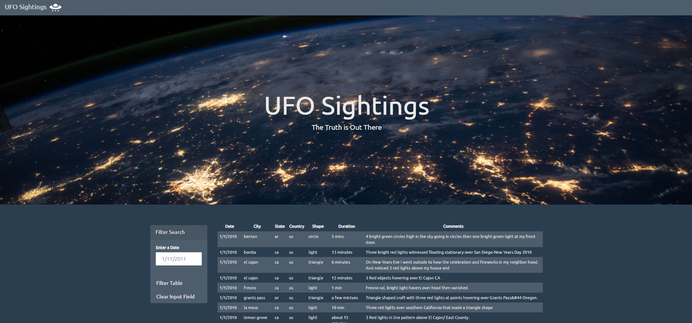
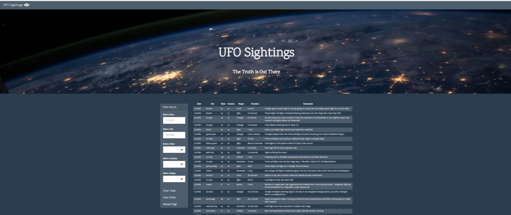

# [UFO-Sightings](https://fereshtehaghaei.github.io/UFO-Sightings/)

## Background

This challenge demonstrates creating an interactive webpage to display a table dynamically for the [UFO Sightings Data](StarterCode/static/js/data.js) allowing user to input their choice from the drop-down to filter the table data.

The JavaScript code lets the user to set multiple filters and search for UFO sightings using the following criteria based on the table columns:

1. `date/time`
2. `city`
3. `state`
4. `country`
5. `shape`

**Languages used:** `JavaScript| D3.js | HTML | CSS | Bootstrap`

## 1st Step:

- Created a custom HTML web page
- Using the UFO dataset provided in the form of an array of JavaScript objects, wrote code that appends a table to the web page and then adds new rows of data for each UFO sighting
- Created columns for `date/time`, `city`, `state`, `country`, `shape`, and `comment` 
- Used a date form in the HTML document and wrote JavaScript code that will listen for events and search through the `date/time` column to find rows that match user input

## 2nd Step:

* Using multiple `input` tags and/or select dropdowns, wrote JavaScript code so the user can to set multiple filters and search for UFO sightings using the following criteria based on the table columns:

  1. `date/time`
  2. `city`
  3. `state`
  4. `country`
  5. `shape`

### Copyright

Fereshteh Aghaei © 2021. All Rights Reserved.
